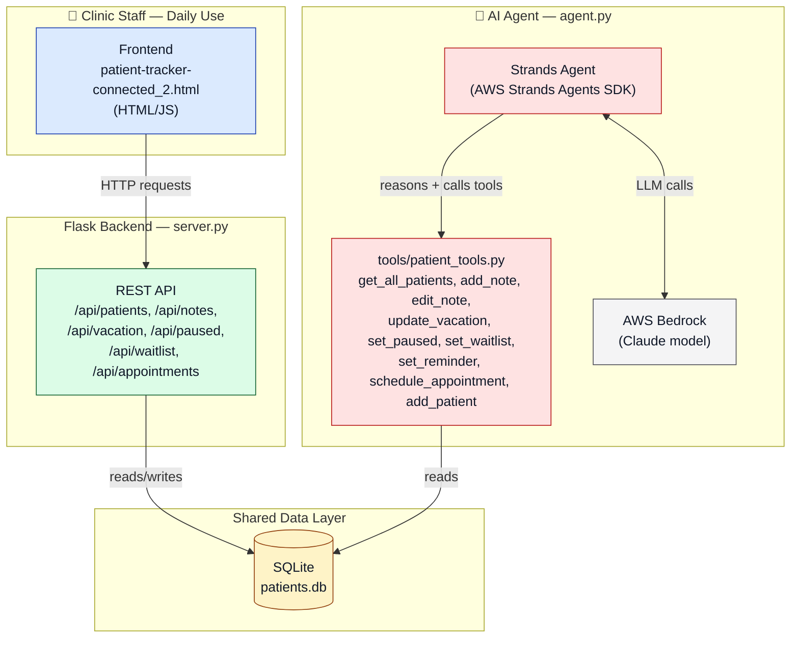

# Patient Follow-Up Tracker

An AI agent that makes sure no patient falls through the cracks.

*© 2026 Tania Rybchenko. Original written content and design authored by Tania Rybchenko. Source code is licensed under MIT/Apache-2.0 per hackathon submission requirements — see `LICENSE`.*

---

## The Problem

At a clinic, a patient finishes an appointment and says something like *"I'll text you guys when I can come in — I have to check my work schedule."* Staff makes a mental note. The patient doesn't call back. Staff assumes someone else is tracking it, or forgets. Weeks later, the patient has quietly missed their treatment window entirely — not because anyone did anything wrong, but because nothing in the day-to-day workflow is built to *notice silence*.

This isn't a minor inconvenience — it's a measurable financial problem:

- **U.S. healthcare loses an estimated $150 billion a year** to missed and un-rebooked appointments (Becker's ASC Review).
- **Independent practices lose $150,000+ a year on average** from patients who don't return — with each missed visit costing roughly $200–$375 once staff time and unfilled slots are counted (Curogram, ProSpyr).
- The damage compounds silently: **a patient who misses one appointment is 70% more likely not to return within the next 18 months**, and for patients managing a chronic condition, the odds of leaving the practice *double* after just one missed visit (Curogram). Every unnoticed gap isn't just one lost appointment — it's the risk of losing that patient's entire future value to the practice, plus worse health outcomes for someone who needed ongoing care.

**And this gets *harder*, not easier, as a practice grows.** A solo practitioner might hold the state of 40 patients in their head. A medium or large practice — with multiple providers, hundreds of active patients, and staff working in shifts — has no realistic way to manually track who among hundreds of people has gone quiet, who's waiting on insurance, who's simply on vacation, and who genuinely needs a call today. The bigger the patient list, the easier it is for exactly this kind of silent drop-off to hide in plain sight — which means the practices with the most to lose in absolute dollars are the ones least equipped to catch it by hand.

This is the gap the project closes: a system that watches for that silence — at any scale — and tells staff exactly who needs a human follow-up today, and why.

---

## Who it's for

Front-desk and clinical staff at any recurring-visit practice — physical therapy, acupuncture, massage, chiropractic, and similar — juggling patient calls, scheduling, and paperwork. The problem it solves scales *with* practice size: a solo provider can track a handful of patients from memory, but a medium or large practice with multiple providers and a large active patient list needs exactly this kind of systematic tracking to catch what memory alone can't.

---

## Built for how clinics actually run

A few features exist specifically because of how clinics actually operate day to day, not just as generic app polish:

- **Staff accountability, without a heavyweight login system.** Each staff member has their own PIN, and every note is stamped with who left it. This matters in practices where a manager or owner still keeps a hand on the patient schedule — the question *"why hasn't this patient been rebooked, who spoke to them last, when are they back?"* is a constant one, especially in shift-based scheduling where the person who took the call and the person following up may not be the same. Attribution turns that from a guessing game into a two-second lookup.
- **Multi-location support.** Practices with more than one office can switch between locations from a dropdown in the header. This reflects a real pattern — patients often split their visits between two locations depending on which is closer to work or home on a given day — so staff need to see the right patient list for the office they're actually sitting in.
- **A note history, not just the latest note.** Each patient shows their last few notes, not just the most recent one. Staff can quickly see whether a cancellation is a one-off or part of a pattern — the difference between *"life happened this one time"* and *"this patient reschedules every single visit,"* which changes how a follow-up call should go.
- **Waitlist reminders that don't let a cancellation slip through.** If a patient wanted an opening that wasn't available, staff can put them on the waitlist. The system reminds staff shortly before that patient's originally preferred time, so a same-day cancellation doesn't go unnoticed. Staff can either book the now-open slot right there or mark "no opening yet" — which re-reminds an hour later, and keeps doing so until the patient's preferred time passes, instead of firing once and being forgotten.

At its heart, it's meant to work like a shared notebook for the whole team — a single place anyone on staff can open to check what's going on with a patient, without having to ask around or dig through memory.

---

## What the agent actually does

The core of the project is a **Strands Agents SDK** agent (running Claude via Amazon Bedrock) that reads the clinic's patient data and reasons about priority — not through hardcoded if/else rules, but through a system prompt that defines *how to think about* the data. Concretely, it:

- **Flags patients with no appointment and no note** as the highest priority — someone needs to call them today.
- **Treats patients with a logged note differently** — lower urgency, since staff already know why they haven't rebooked.
- **Recognizes previous vacation without penalizing it** — a patient on vacation isn't overdue; the agent waits until their return date to resurface them.
- **Distinguishes "paused" from "ignoring us."** If a patient can't schedule because insurance ran out of visits for the year, that's not a follow-up problem — it's a waiting problem. The agent excludes paused patients from the urgent list entirely, and instead reminds staff only when their coverage is expected to reset.
- **Reads notes for time cues and sets its own reminders.** When staff type something like *"said she'll call back tomorrow,"* the agent parses that note, calculates the actual date it refers to, and sets a reminder — so staff don't have to remember it themselves. This is the clearest example of the agent doing real reasoning rather than just applying a fixed rule.

---

## How it's built



- **`patient_tools.py`** — the agent's tools: read patients, add/edit/delete notes, log vacation (with a from–to range), mark a patient paused (with reason + resume date), set a waitlist flag, set a reminder, schedule an appointment, add a new patient.
- **`agent.py`** — the Strands agent itself: model, tools, and the system prompt that defines its priority logic and reminder-detection behavior.
- **`server.py`** — a small Flask API that exposes the tools and agent over HTTP, so the browser UI can call them.
- **Frontend** — a single-page HTML/JS interface: filterable patient table, PIN-based staff login (lightweight, demo-scoped — see *Scope decisions* below), note history, inline vacation/pause/scheduling panels.

---

## Setup — how to run this project

**Requirements:** Python 3.12+, an AWS account with Bedrock access (for the AI agent), and the AWS CLI configured for SSO login.

1. **Clone the repository**
   ```
   git clone https://github.com/taniaDsgn/patient-follow-up-tracker.git
   cd patient-follow-up-tracker
   ```

2. **Set up a virtual environment and install dependencies**
   ```
   python3 -m venv venv
   source venv/bin/activate
   pip install -r requirements.txt
   ```

3. **Authenticate with AWS** (needed for the agent to call Amazon Bedrock)
   ```
   aws login
   ```

4. **Start the Flask API server**
   ```
   python server.py
   ```
   This runs on `http://127.0.0.1:5000` and serves the patient data to the frontend.

5. **Open the frontend**
   Open `frontend/patient-tracker-connected_2.html` directly in a browser (double-click it, or drag it into a Chrome window). No build step required — it's a single static HTML file that talks to the Flask server above.

6. **Run the AI agent directly (optional)**
   To see the agent's reasoning on its own, without the UI:
   ```
   python agent.py
   ```
   This prints the agent's full follow-up analysis for the day, reasoning through the patient database using its tools.

**Note:** the app ships with `patients.db`, pre-populated with synthetic demo patients — no setup needed to see it working end to end.

---

## A key design decision: computed, not stored, status

Early versions stored each patient's status (`needs follow-up`, `scheduled`, etc.) as a field that got set directly — which meant it was possible for the data to end up in a contradictory state, like a patient being both "needs follow-up" *and* "scheduled" at once. That's a real bug class, not just a cosmetic issue.

The fix was architectural: status is now **always derived** from underlying facts (does this patient have a note? a booked appointment? are they paused or on vacation?) through a single function, every time the data is displayed. A patient with a booked appointment can never show "needs follow-up," because the derivation logic makes that combination unreachable — not because someone remembered to check.

---

## Scope decisions (and why)

Given the build timeline, a few things were deliberately kept simple so effort could go toward the agent itself:

- **Staff login is PIN-based and in-memory**, not a real authentication system — appropriate for a demo, not production. In a real deployment this would connect to the clinic's actual staff management system.
- **No live EHR/scheduling integration** (e.g. DrChrono). All appointment data is entered manually by staff. This was a deliberate choice, partly for scope and partly because real patient scheduling data is PHI — the project uses entirely synthetic patient data throughout.
- **One next-appointment date per patient**, not a list — sufficient for the demo, a natural next step for a real deployment.

---

## How this is different from existing tools

There's a real, established category of AI tools in this space — no-show prediction platforms (Coforix, Genie, Novoflow), automated reminder systems (OmniMD, Phreesia), and risk-scoring built into EHRs like Epic. It's worth being clear about how this project differs, rather than pretending the space is empty:

- **A different point in the problem.** Existing tools predict which patients will miss an *already-scheduled* appointment and reach out to confirm or rebook it. This project solves the earlier, quieter problem: patients who never rescheduled *at all* after their last visit — before there's even an appointment on the calendar to predict against.
- **No automated patient contact.** The established tools call, text, or message patients directly. This agent never contacts a patient — it only tells staff who to check on and why, keeping a human in the loop for what is ultimately a judgment call, not a scripted outreach.
- **Reasoning about *why*, not just *risk*.** No-show prediction tools optimize for a risk score. This agent distinguishes between fundamentally different situations — a patient ignoring calls, a patient on vacation, a patient waiting on insurance to reset — because each one calls for a different response from staff, not the same automated nudge.

---

## What's next

- **Two-way EHR sync (DrChrono or similar), under a proper BAA.** When a visit is booked or cancelled directly in DrChrono, a webhook would update the patient's status here automatically — "Scheduled" with the real date and time on booking, "Needs follow-up" on cancellation — no manual entry required. Editing the appointment time here would push the same change back to DrChrono through its API, so staff only ever have to update one place and both systems stay in sync. Manual entry would remain for the one thing DrChrono can't tell you: *why* a patient hasn't rebooked.
- **A manager view summarizing staff activity.** The PIN attribution already answers "who spoke to this patient last" for one person; the natural next step is a rolled-up view for owners and managers — notes logged and follow-ups closed per staff member — so the same question can be answered at the team level, not just patient by patient.
- **Autonomous, scheduled agent runs via Amazon Bedrock AgentCore**, instead of a manual CLI trigger — so the daily follow-up analysis happens on its own each morning rather than requiring someone to run it.
- Multi-appointment scheduling per patient
- Real staff account management
- Agent-driven desktop notifications reflecting live follow-up data, not just a manual demo trigger
